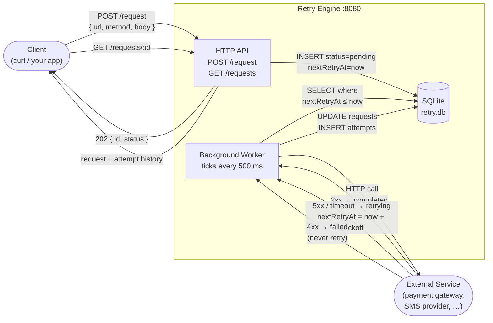
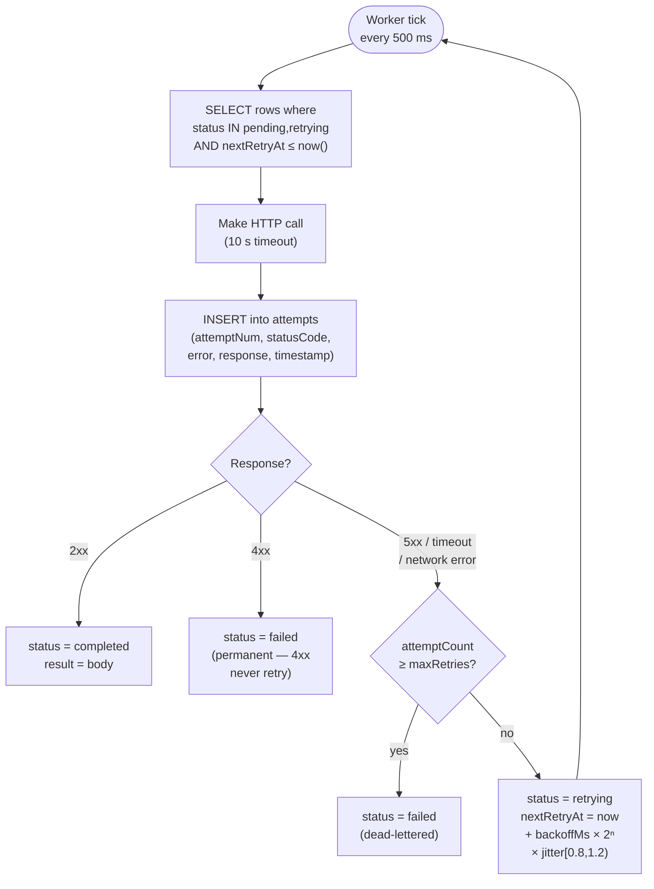

# Retry Engine

A small HTTP service that accepts outbound HTTP jobs, persists them to SQLite,
and retries them on failure using exponential backoff with jitter.

---

## Architecture

### Component overview



### Worker retry flow



---

## Setup & Start

### 1. Clone / download the source

```
RETRY-ENGINE/
├── demo/
│   └── main.go
├── db.go
├── handlers.go
├── main.go
├── models.go
├── worker.go
└── go.mod
```

### 2. Install dependencies

```bash
go mod tidy
```

### 3. Build

```bash
# Linux / macOS / WSL
CGO_ENABLED=1 go build -o retryengine .

# Windows (PowerShell) — modernc driver, no GCC needed
go build -o retryengine.exe .
```

### 4. Start the server

```bash
# Linux / macOS
./retryengine

# Windows
.\retryengine.exe
```

The server starts on **`:8080`** and creates `retry.db` in the current directory.

```
2025/01/15 12:00:00 Retry engine listening on :8080
```

### 5. (Optional) Run the demo

The demo starts a mock server that fails 3 times then succeeds, submits a job,
and prints a live backoff/jitter table.

```bash
cd demo
go build -o demo.exe .   # or: go build -o demo .
.\demo.exe
```

---

## API Reference

### POST /request — submit a job

Saves the request and returns immediately. The background worker does the actual HTTP call.

```bash
curl -X POST http://localhost:8080/request \
  -H "Content-Type: application/json" \
  -d '{
    "url":        "https://example.com/api/pay",
    "method":     "POST",
    "body":       "{\"amount\": 99}",
    "maxRetries": 5,
    "backoffMs":  1000
  }'
```

**Response `202 Accepted`:**

```json
{
  "id": "a1b2c3d4-...",
  "status": "pending"
}
```

| Field        | Type   | Default  | Description                         |
| ------------ | ------ | -------- | ----------------------------------- |
| `url`        | string | required | Target URL                          |
| `method`     | string | required | HTTP method (`GET`, `POST`, etc.)   |
| `body`       | string | `null`   | Raw request body                    |
| `maxRetries` | int    | `5`      | Max attempts before dead-lettering  |
| `backoffMs`  | int    | `1000`   | Base wait in ms; doubles each retry |

---

### GET /requests/:id — get a job and its history

```bash
curl http://localhost:8080/requests/a1b2c3d4-...
```

**Response `200 OK`:**

```json
{
  "id": "a1b2c3d4-...",
  "url": "https://example.com/api/pay",
  "method": "POST",
  "status": "retrying",
  "attemptCount": 2,
  "maxRetries": 5,
  "backoffMs": 1000,
  "nextRetryAt": "2025-01-15T12:00:04.000Z",
  "lastError": "server error 500",
  "createdAt": "2025-01-15T12:00:00.000Z",
  "updatedAt": "2025-01-15T12:00:02.000Z",
  "attempts": [
    {
      "id": 1,
      "requestId": "a1b2c3d4-...",
      "attemptNum": 1,
      "statusCode": 500,
      "error": "server error 500",
      "response": "Internal Server Error",
      "attemptedAt": "2025-01-15T12:00:00.500Z"
    },
    {
      "id": 2,
      "requestId": "a1b2c3d4-...",
      "attemptNum": 2,
      "statusCode": 500,
      "error": "server error 500",
      "response": "Internal Server Error",
      "attemptedAt": "2025-01-15T12:00:02.000Z"
    }
  ]
}
```

| `status` value | Meaning                                                       |
| -------------- | ------------------------------------------------------------- |
| `pending`      | Queued, first attempt not yet made                            |
| `retrying`     | At least one failure; waiting for next attempt                |
| `completed`    | A 2xx response was received                                   |
| `failed`       | Dead-lettered: either 4xx received, or `maxRetries` exhausted |

---

### GET /requests?status= — list jobs by status

```bash
# All failed (dead-lettered) jobs
curl http://localhost:8080/requests?status=failed

# All jobs currently waiting to retry
curl http://localhost:8080/requests?status=retrying

# All completed jobs
curl http://localhost:8080/requests?status=completed

# All pending (not yet attempted)
curl http://localhost:8080/requests?status=pending

# All jobs (no filter)
curl http://localhost:8080/requests
```

**Response `200 OK`** — array, newest first:

```json
[
  {
    "id": "a1b2c3d4-...",
    "url": "https://example.com/api/pay",
    "status": "failed",
    "attemptCount": 5,
    "lastError": "server error 503",
    ...
  }
]
```

Returns `[]` (not `null`) when no rows match.

---

## Backoff & Jitter Reference

```
attempt 1  →  backoffMs × 2⁰ × jitter  =  ~1000 ms
attempt 2  →  backoffMs × 2¹ × jitter  =  ~2000 ms
attempt 3  →  backoffMs × 2² × jitter  =  ~4000 ms
attempt 4  →  backoffMs × 2³ × jitter  =  ~8000 ms
attempt 5  →  backoffMs × 2⁴ × jitter  =  ~16000 ms
```

`jitter` is a random multiplier sampled uniformly from **[0.8, 1.2)** on every
attempt, preventing multiple clients from retrying in lockstep (thundering herd).

---

## Database Schema

```sql
-- One row per submitted job
SELECT id, url, method, status, attempt_count,
       next_retry_at, last_error, result
FROM   requests;

-- One row per HTTP call made
SELECT request_id, attempt_num, status_code,
       error, response, attempted_at
FROM   attempts
WHERE  request_id = 'a1b2c3d4-...'
ORDER  BY attempt_num;
```

---

## Core Concepts

The retry engine focuses on making sure requests made to external API services are properly handled in the event of a failure. This works by retrying the requests again and incorporating **exponential backoff** and **jitter** during the retry process.

**Exponential backoff**: Is the idea that if a service is struggling to get a good response, retrying the request every second will make things worse. Instead of retrying immediately a failure occurs, we wait and double the wait time on each retry. This gives the - already struggling - service some room to recover

**Jitter**: This is a little bit of randomness added to each wait. Say a 100 clients are trying to request the same service at the same time, they'll all retry the route at the same time, which will cause a lot of load on the server which, again, is already struggling get data out. With jitter, we can be sure that retries don't happen at the same time and spreads out the load.

Some errors(`5xx`) are retried while others(`4xx`) are not. A `500` error means the _server_ had an unexpected problem. This could be due to the server not expecting the amount of load it's getting at the moment or some other problem that could be resolved in a few seconds, so retrying wouldn't hurt. This also goes for network timeout or drops, a retry could get a different response. With `400` errors, the request is malformed and retrying the server with malformed data changes nothing; you will get the same response every time.

### Personal struggles while making this

- **Goroutines**: As someone who's trying to learn Go(and backend in general) the worker handling the retries was a bit tricky to understand.

### Concepts learned

1. How to properly reply when building APIs(obviously)
2. Goroutines and channels
3. Jitter and why it's really important despite being such a seemingly small thing to add.

### Resources consulted

- Started with [this blog post](https://dev.to/leapcell/7-retry-patterns-you-should-know-3125). Advanced stuff, did not help at all
- Found [this instead](https://dev.to/kengowada/when-apis-fail-a-developers-journey-with-retries-back-off-and-jitter-1g2f), was very helpful and beginner-friendly.
- Due to time and me being a novice at Go, the project was made with a simple claude prompt
  _How do i make a tool like this in Go? After generating, explain step by step what's going on at a high level_

### How this has made me a better developer

1. Before this project, I never even considered retries as a thing to implement. I'd see it happen on sites I used, but never really questioned it too much. Now I know how it works and how to implement it. I can handle upstream failures better now and won't just lump them together with my APIs failures.
2. I understand channels in Go better now. Coming from Javascript, the idea of channels never really made sense to me, but after working on this project and looking into why channels had to be used with the goroutines, I can confidently say I understand and can use channels properly now.
